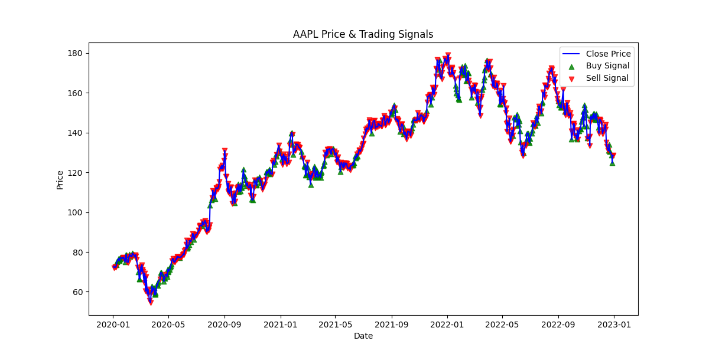
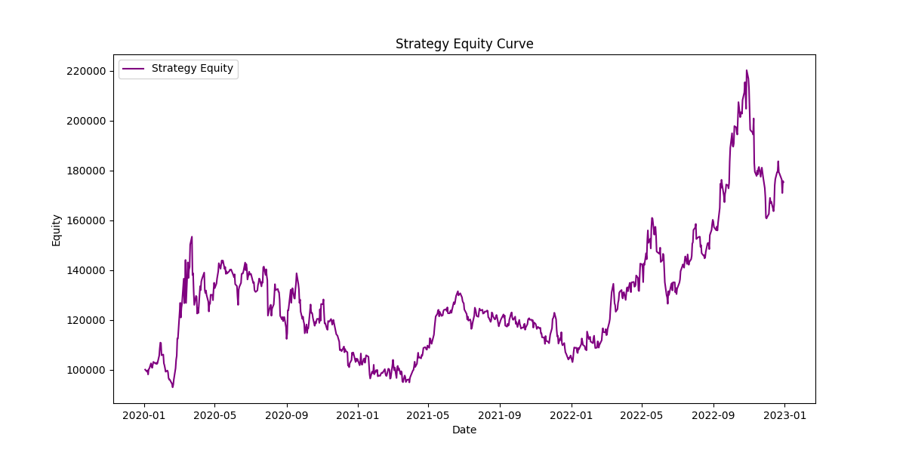

# Enhanced Statistical Arbitrage Strategy in Equity Markets

This project implements a **dual-strategy** trading system combining **momentum** (via MACD) and **mean reversion** (via RSI) signals. It pulls historical stock data (in this example, from Yahoo Finance for AAPL), computes technical indicators, generates buy/sell signals, and backtests the resulting strategy using a simplified framework.

---

## Table of Contents
1. [Project Overview](#project-overview)  
2. [Directory Structure](#directory-structure)  
3. [Installation and Setup](#installation-and-setup)  
4. [Usage](#usage)  
5. [Results](#results)  
6. [Future Improvements](#future-improvements)

---

## Project Overview
The system demonstrates how to:
- **Load** historical price data using [yfinance](https://pypi.org/project/yfinance/).  
- **Calculate** momentum (MACD) and mean-reversion (RSI) indicators.  
- **Generate** trading signals that combine both approaches (e.g., RSI < 30 ⇒ oversold ⇒ buy).  
- **Backtest** the signals with a simple daily trading model, tracking PnL and calculating basic performance metrics like Sharpe Ratio.

---

## Directory Structure

.
├── data/
│   └── README.md         # Placeholder for data-related info or CSV files
├── src/
│   ├── backtest.py       # Backtesting logic to evaluate signals
│   ├── data_loader.py    # Loads/fetches historical data (via yfinance or local CSV)
│   ├── features.py       # Technical indicator calculations (RSI, MACD)
│   ├── strategy.py       # Signal generation logic (momentum + mean reversion)
│   ├── utils.py          # Utility functions for plotting, helper methods, etc.
│   └── pycache/      # Automatically generated cache files
├── main.py               # Orchestrates end-to-end data load, signal gen, backtest, plots
├── requirements.txt      # Python dependencies required to run the project
└── README.md             # This file, describing the project

---

## Installation and Setup

1. **Clone or download** this repository.

2. **Create and activate** a Python virtual environment (optional but recommended):

   ```bash
   # Create a virtual environment
   python -m venv venv

   # Activate it (Windows Command Prompt)
   venv\Scripts\activate

   # Or, if you're on macOS/Linux
   source venv/bin/activate

	3.	Install required packages:

pip install -r requirements.txt


	Note: Adjust package versions if needed.

Usage
	1.	Open a terminal in the project’s root directory (where main.py is located).
	2.	Run the end-to-end pipeline:

python main.py

	•	This will load historical data for the specified ticker (default is AAPL from 2020-01-01 to 2023-01-01), calculate RSI and MACD, generate buy/sell signals, run a backtest, and display:
	•	Backtest Summary in the console (final equity, total return, annualized Sharpe ratio, etc.).
	•	Matplotlib charts for price with trading signals and the strategy’s equity curve.

Results

Below is an example console output for a sample run:

Data loaded for AAPL from 2020-01-01 to 2023-01-01. Rows: 756
=== Backtest Summary ===
Initial Capital: 100000.0
Final Equity: 175262.84
Total Return: nan%
Annualized Sharpe Ratio: 0.69

Two plots also appear:
	1.	Price & Trading Signals: Shows the closing price with buy (green triangle) and sell (red inverted triangle) signals.
	2.	Strategy Equity Curve: Shows the daily evolution of the portfolio’s equity if you followed the generated signals.
 
	Note:
		•	The Total Return: nan% can sometimes occur due to specific data-handling or missing values. Check the date range, data continuity, or confirm that there are enough valid return data points.

Future Improvements
	•	Transaction Costs & Slippage: Factor in broker fees, bid/ask spread, and partial fills for more realism.
	•	Position Sizing: Use volatility-adjusted or capital-proportional position sizes instead of a static ±1 share model.
	•	Hyperparameter Tuning: Optimize RSI and MACD parameters via cross-validation or walk-forward analysis.
	•	Multi-Asset Strategy: Extend to pairs or basket trading for more nuanced statistical arbitrage approaches.
	•	Risk Management: Add stop-loss rules, max drawdown thresholds, or volatility-based position scaling.

Thank you for checking out this project! Feel free to fork it, experiment with new indicators, or adapt it for different tickers and markets.

